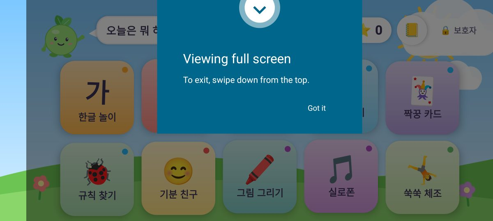
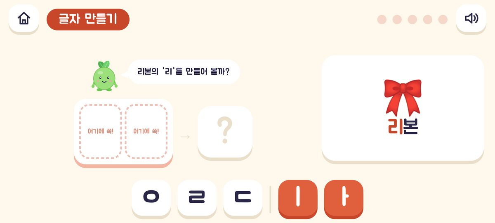
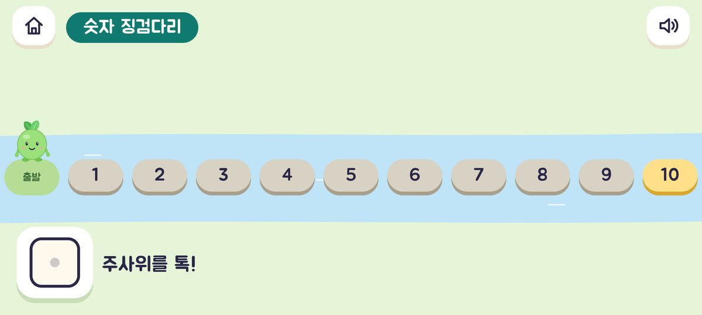
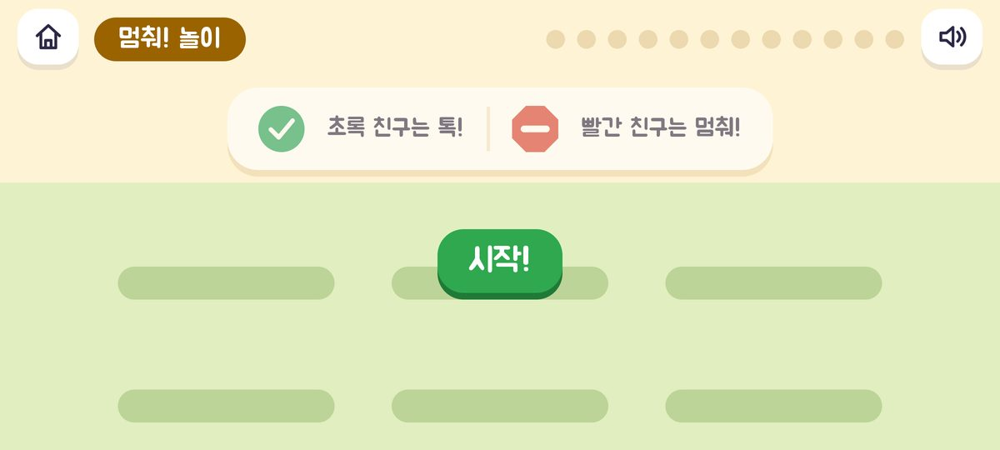
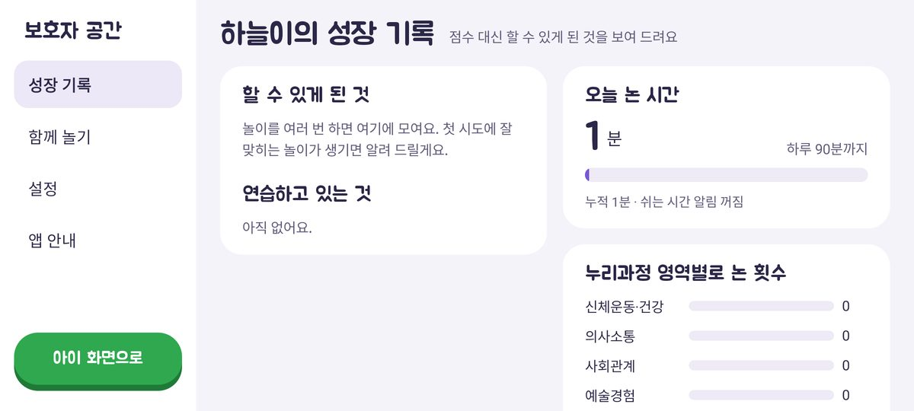
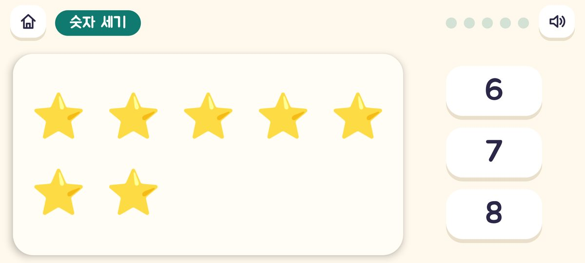
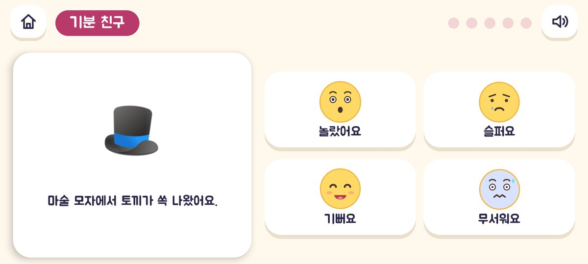
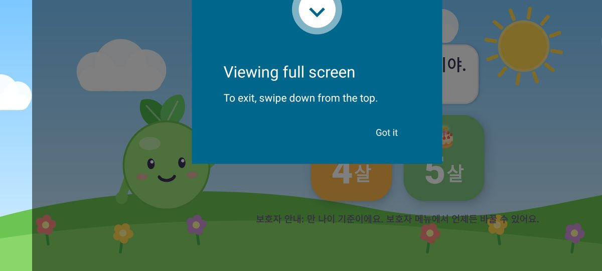

# 쑥쑥 놀이터 🌱

만 4~5세 유아를 위한 **누리과정 연계 인터랙티브 애니메이션 놀이 학습 Android 앱**입니다.
새싹 친구 **쑥쑥이**가 아이 이름을 부르며 인사하고, 13가지 놀이로 누리과정 5개 영역(신체운동·건강, 의사소통, 사회관계, 예술경험, 자연탐구)을 고르게 경험하게 합니다.

2.0에서는 국내외 아동발달·유아교육 연구를 검토해([`docs/RESEARCH.md`](docs/RESEARCH.md)) 칭찬·보상·피드백·난이도·놀이 시간을 근거에 맞게 다시 설계하고, 새 놀이 3개(글자 만들기, 숫자 징검다리, 멈춰! 놀이)를 더했습니다.

- Kotlin + Jetpack Compose, 단일 액티비티
- 그림·캐릭터·애니메이션은 코드로 그리고, 효과음·실로폰 소리도 코드로 합성합니다. 글꼴은 주아체(SIL OFL)를 넣었습니다.
- 모든 안내를 한국어 음성으로 들려주어 글을 읽지 못해도 혼자 놀 수 있습니다. [고품질 녹음 음성](#고품질-음성-genspark)을 넣으면 그 음성을, 없으면 기기 음성 합성(TTS)을 씁니다.
- 인터넷 권한 없음, 광고·결제·외부 전송 없음. 아이 이름과 기록은 기기 안에만 저장됩니다.

---

## 화면 미리보기

에뮬레이터(가로 휴대폰, 만 5세 설정, 예시 이름 "하늘")에서 자동으로 캡처한 화면입니다. 전체 캡처는 [`docs/screenshots`](docs/screenshots)에 있습니다.
디자인 시안은 Claude 디자인 캔버스로 먼저 만든 뒤(홈, 글자 만들기, 숫자 징검다리, 멈춰! 놀이, 축하·대화 카드, 보호자 성장 기록, 쉬는 화면) 코드로 옮겼습니다.

| 홈 | 글자 만들기 |
|---|---|
|  |  |
| **숫자 징검다리** | **멈춰! 놀이** |
|  |  |
| **놀이를 마쳤을 때** (과정 칭찬 · 깜짝 선물 · 함께 이야기해요) | **보호자 성장 기록** |
|  |  |
| **숫자 세기** | **기분 친구** |
|  |  |
| **오늘 놀이 끝** | **첫 실행** |
|  |  |

## 놀이 구성과 누리과정 연계

난이도는 1~3단계입니다. 나이는 출발점일 뿐이고(만 4세 1단계, 만 5세 2단계), **놀이마다** 아이가 첫 시도에 맞힌 비율에 따라 한 판씩 오르내립니다(80% 이상 ↑, 50% 미만 ↓).

| 놀이 | 누리과정 영역 | 이렇게 놀아요 | 1단계 | 2~3단계 |
|---|---|---|---|---|
| **한글 놀이** | 의사소통 | 자음 카드 보며 따라 쓰기 / 첫소리가 같은 그림 찾기. 자음은 **이름과 소리를 함께**("기역은 '그' 소리") | 선택지 3개 | 비슷한 자음(ㄱ/ㅋ …) 섞기, 3단계 선택지 4개 |
| **글자 만들기** 🆕 | 의사소통 | 자음·모음 조각을 넣으면 소리를 이어 읽어요("느, 아, 나!") | 모음 ㅏ만 | ㅏ·ㅗ·ㅜ·ㅣ |
| **숫자 세기** | 자연탐구 | 하나씩 눌러 세고 숫자 고르기. 맞히면 **"모두 세 개!"**, 두 번 틀리면 같이 세어 보여 줘요 | 1~5 | 1~10, 3단계 선택지 4개 |
| **숫자 징검다리** 🆕 | 자연탐구 | 1~10 일직선 돌을 주사위만큼 건너며 칸의 수를 말해요 | 주사위 1~2 | 1~3, "몇에 도착했을까?" |
| **모양 맞추기** | 자연탐구 (+소근육) | 도형 조각을 끌어 같은 모양 자리에 넣기 | 3개 × 2판 | 5개 × 3판 |
| **규칙 찾기** | 자연탐구 | 반복 규칙 다음에 올 그림 고르기 | AB, AAB | ABB, ABC |
| **짝꿍 카드** | 자연탐구 | 같은 그림 두 장 찾기 | 4쌍, 3초 미리 보기 | 6쌍, 2초(3단계 1.4초) |
| **기분 친구** | 사회관계 | 상황을 듣고 친구의 기분 고르기. 그럴 법한 다른 감정도 인정, 화남·무서움 뒤 **거북이 숨쉬기** | 기쁨·슬픔·화남·무서움 | + 놀람 |
| **멈춰! 놀이** 🆕 | 신체운동·건강 (자기조절) | 초록 친구는 톡, 빨간 친구는 멈춰! | 규칙 하나 | 중간에 "이번엔 반대로!" |
| **쑥쑥 체조** | 신체운동·건강 | 쑥쑥이 동작 따라 하기 | 5동작 | 7동작 |
| **색깔 풍선** | 예술경험 | 말하는 색의 풍선만 터뜨리기 | 4가지 색 | 7가지 색, 더 빠르게 |
| **그림 그리기** | 예술경험 | 크레용·무지개 붓·도장·지우개 | 자유 | 자유 |
| **실로폰** | 예술경험 | 자유 연주 / 반짝이는 막대 따라 노래 치기 | 노래 앞부분 | 노래 전체 |

> 영역·내용 범주는 2019 개정 누리과정(교육부·보건복지부 고시)을 기준으로 정리했습니다. 수업·연구에 활용하실 때는 고시 원문과 해설서를 함께 확인해 주세요.
> 실로폰 노래는 저작권이 만료된 전래 선율(도레미 계단, 반짝반짝 작은 별, 비행기)만 사용하고 가사는 넣지 않았습니다.

## 설계 원칙 (근거는 [`docs/RESEARCH.md`](docs/RESEARCH.md))

1. **과정 칭찬** – "최고야" 대신 "잘 보고 골랐구나", "다시 생각해서 찾아냈구나"처럼 아이가 한 일을 짚어 줍니다(Cimpian 외 2007).
2. **예고된 보상 줄이기** – 스티커는 문제가 있는 놀이를 **그날 처음 마쳤을 때만** 선물 상자 3개 중 하나를 스스로 고릅니다. 무작위 보상, 별 개수, 수집 개수는 보여 주지 않습니다(Deci 외 1999; Radesky 외 2022).
3. **설명하는 피드백과 단계적 힌트** – 틀리면 왜 다른지 말해 주고("나비는 니은으로 시작해요"), 두 번 틀리면 같이 세어 보여 주거나 정답 쪽을 살짝 알려 줍니다.
4. **어른과 함께** – 놀이를 마칠 때마다 보호자에게 "함께 이야기해요" 카드를 보여 줍니다(Mathers 외 2025; Taylor 외 2024).
5. **발달 순서 존중** – 한글은 CV 음절부터(Cho 2009), 감정은 기쁨·슬픔·화남·무서움 다음 놀람(Widen & Russell 2003), 수는 일직선 수판과 기수 원리(Siegler & Ramani 2009).
6. **방해 요소 줄이기** – 평평한 배경, 누리과정 영역 색으로 묶은 타일, 선 아이콘. 계속 움직이는 장식은 없앴습니다(Fisher 외 2014).
7. **바른 미디어 습관** – 하루 놀이 시간(기본 60분)과 쉬어 가기(20분). 끝나기 3분 전에 알려 주고, 홈의 **해님 막대**로 남은 시간을 그림으로 보여 줍니다. 쉬는 화면은 화면 밖 놀이를 권합니다(WHO 2019; Hiniker 외 2016).
8. **안전과 개인정보** – 위험 권한과 인터넷 권한이 없고, 보호자 메뉴는 두 자리 덧셈 문제로 잠겨 있습니다.

## 우리 아이에 맞추기

- **이름**: 첫 실행 화면이나 보호자 메뉴 › 설정에서 부르는 이름을 적으면 쑥쑥이가 "안녕, ○○아!" 하고 불러 줍니다. 이름은 기기 안에만 저장되고 이 저장소나 인터넷으로 보내지 않습니다.
- **나이**: 만 4세/5세. 바꾸면 놀이별 단계가 새 나이의 출발점으로 돌아갑니다.
- **놀이 시간**: 하루 30/45/60/90분 또는 제한 없음, 쉬어 가는 간격 10~30분 또는 끄기.

## 고품질 음성 (Genspark)

앱이 말하는 문장(약 940개)은 코드에서 자동으로 [`voice/lines.txt`](voice/lines.txt)로 모아 둡니다. 이 목록으로 [Genspark CLI](https://www.npmjs.com/package/@genspark/cli)의 음성 모델(기본: Gemini 3.8 Flash TTS)로 음성 파일을 한 번에 만들 수 있습니다. 파일이 있는 문장은 그 음성으로, 없는 문장은 기기 음성 합성으로 읽습니다. 한 안내 안에서 목소리가 바뀌지 않도록, 문장 중 하나라도 파일이 없으면 그 안내 전체를 기기 음성으로 읽습니다.

```bash
npm install -g @genspark/cli
gsk login                                     # 브라우저로 로그인 (API 키 발급)
cd kids-edu-app
node tools/make-voice.mjs --sample            # 몇 문장만 voice/samples/ 에 만들어 목소리 들어 보기
node tools/make-voice.mjs --name 하늘          # 전체 만들기 (이름 인사 포함, 이미 만든 파일은 건너뜀)
```

- 일반 문장은 `app/src/main/assets/voice/`에, 아이 이름이 들어간 인사("안녕, 하늘아!")는 `app/src/main/assets/voice_personal/`에 저장됩니다. `voice_personal/`은 `.gitignore`에 있어 저장소에 올라가지 않으므로, 이름 음성까지 넣으려면 그 PC에서 APK를 빌드하세요. 이름 음성이 없으면 이름 부분만 빼고 녹음 음성으로 읽습니다.
- 약 1만 자 → Gemini 3.8 Flash TTS 기준 약 520크레딧(20자당 1크레딧). 실행 전에 예상치를 보여 주고 확인을 받습니다.
- 목소리·말투는 `--voice`, `--instructions`, 다른 모델은 `--model`과 `--params`로 바꿀 수 있습니다(`--list-voices`로 모델 정보 확인). [ffmpeg](https://ffmpeg.org/)가 있으면 파일을 모노 48kbps MP3로 줄여 앱 크기를 작게 유지합니다.
- 문장을 바꾼 뒤에는 `./gradlew :app:testDebugUnitTest --tests '*VoiceScriptTest*' -PupdateVoiceLines=true`로 목록을 다시 만드세요. 목록이 코드와 다르면 단위 테스트가 실패합니다.

## 설치하기

### 방법 1. 빌드된 APK 받기 (GitHub Actions)

이 저장소의 GitHub Actions가 `kids-edu-app/` 변경 때마다 테스트 → Lint → 디버그 APK 빌드를 실행합니다.

1. 저장소의 **Actions** 탭 → **쑥쑥 놀이터 Android 빌드** → 최근 성공한 실행을 엽니다.
2. 아래 **Artifacts**에서 `ssukssuk-playground-debug-apk`를 내려받아 압축을 풉니다.
3. `app-debug.apk`를 Android 기기(Android 8.0 이상)로 옮겨 설치합니다. 처음이라면 기기 설정에서 "출처를 알 수 없는 앱 설치"를 허용해야 합니다.

### 방법 2. Android Studio에서 직접 빌드

1. Android Studio(최신 안정 버전)에서 `kids-edu-app` 폴더를 엽니다.
2. Gradle 동기화가 끝나면 기기나 에뮬레이터를 연결하고 ▶ Run을 누릅니다.

```bash
cd kids-edu-app
./gradlew testDebugUnitTest   # 단위 테스트
./gradlew assembleDebug       # app/build/outputs/apk/debug/app-debug.apk
```

> 녹음 음성이 없을 때는 기기의 한국어 TTS를 씁니다. 소리가 나오지 않으면 기기 설정 > 텍스트 음성 변환(TTS)에서 Google 음성 엔진의 한국어 데이터를 설치해 주세요.

> Play 스토어 배포용 릴리스 APK/AAB는 서명 키가 필요합니다. Android Studio의 **Build > Generate Signed App Bundle / APK**를 이용하세요. Google Play 가족 정책(아동 대상 앱)도 함께 확인해 주세요.

## 보호자 메뉴

두 자리 덧셈으로 확인한 뒤 들어갑니다.

- **성장 기록**: 점수 대신 '할 수 있게 된 것'(첫 시도 10문항 이상·정답률 75% 이상)과 '연습하고 있는 것'(현재 단계), 오늘 놀이 시간, 누리과정 영역별로 논 횟수, 놀이별 기록
- **함께 놀기**: 놀이별 대화 거리와 화면 밖 놀이 목록
- **설정**: 이름, 나이, 음성 안내, 효과음, 하루 놀이 시간, 쉬어 가는 간격, 기록 초기화
- **앱 안내**: 설계 근거 요약

기기 설정의 **앱 고정(화면 고정)**을 켜 두면 아이가 다른 앱으로 나가지 않습니다.

## 프로젝트 구조

```
kids-edu-app/
├── app/src/main/java/com/ssukssuk/playground/
│   ├── MainActivity.kt      # 전체 화면, 뒤로 가기, 앱 생명주기
│   ├── core/                # 순수 Kotlin: 놀이·영역 정의, 적응형 난이도, 설정·기록·깜짝 선물
│   ├── content/             # 순수 Kotlin: 자음·음절 낱말, 감정 상황, 대화 카드, 앱이 말하는 모든 문장(Lines), 음성 목록(VoiceScript)
│   ├── logic/               # 순수 Kotlin: 문제 생성기, 글자 조립, 징검다리 판, 멈춰! 계획, 짝꿍 카드 규칙
│   ├── audio/               # 순수 Kotlin: 효과음·실로폰 음 합성, WAV 인코더
│   ├── platform/            # Android: 녹음 음성 재생(ClipSpeaker), TTS, SoundPool, SharedPreferences
│   └── ui/                  # 화면·놀이·부품(ChunkyBox 입체 판, 선 아이콘, 쑥쑥이), 테마(주아체, 영역 색)
├── voice/lines.txt          # 음성 문장 목록 (자동 생성)
├── tools/make-voice.mjs     # Genspark CLI로 음성 파일 만들기
├── third_party/jua/OFL.txt  # 주아체 라이선스
└── docs/                    # 문헌 연구(RESEARCH.md), 화면 캡처
```

`core`, `content`, `logic`, `audio`는 Android에 의존하지 않아 JVM 단위 테스트로 검증합니다(`app/src/test`): 조사 선택, 음절 조립, 적응형 단계, 하루 1회 깜짝 선물, 감정 순서, 징검다리·멈춰! 규칙, 음성 파일 이름 해시(스크립트와 같은 값), 음성 목록 최신 여부 등.

`app/src/androidTest`의 `ScreenshotTour`는 에뮬레이터에서 모든 화면을 띄우는 스모크 테스트입니다. 커밋 메시지에 `[screenshots]`를 넣거나 Actions 탭에서 **쑥쑥 놀이터 화면 캡처**를 실행하면 `docs/screenshots`가 갱신됩니다.

## 새 놀이 추가하기

1. `core/Game.kt`의 `Game`에 항목을 추가합니다(제목, 누리과정 영역, 관련 내용, 보호자용 '할 수 있게 된 것' 문구). 아이콘은 `ui/components/Icons.kt`에 선으로 그립니다.
2. 아이에게 들려줄 문장은 `content/Lines.kt`에 넣고 `content/VoiceScript.kt`의 목록에도 추가합니다.
3. `ui/games/`에 `@Composable fun NewGame(env: GameEnv)`를 만들고 `GameScaffold`로 감쌉니다. 난이도는 `env.difficulty`, 칭찬은 `env.praise(afterMiss)`, 끝나면 `env.complete(첫 시도에 맞힌 수, 문제 수)`.
4. `ui/games/GameEnv.kt`의 `GameContent`에 연결하고, `content/Together.kt`에 대화 카드를 넣습니다.

## 기술 정보

- minSdk 26 (Android 8.0) / targetSdk 36
- AGP 8.11.1, Kotlin 2.2.0, Compose BOM 2025.08.00, JDK 17
- 가로 화면 전용(태블릿·휴대폰), 전체 화면(시스템 바 숨김)
- 글꼴: [주아체](https://fonts.google.com/specimen/Jua) (The Jua Project Authors, SIL Open Font License 1.1, [`third_party/jua/OFL.txt`](third_party/jua/OFL.txt))
